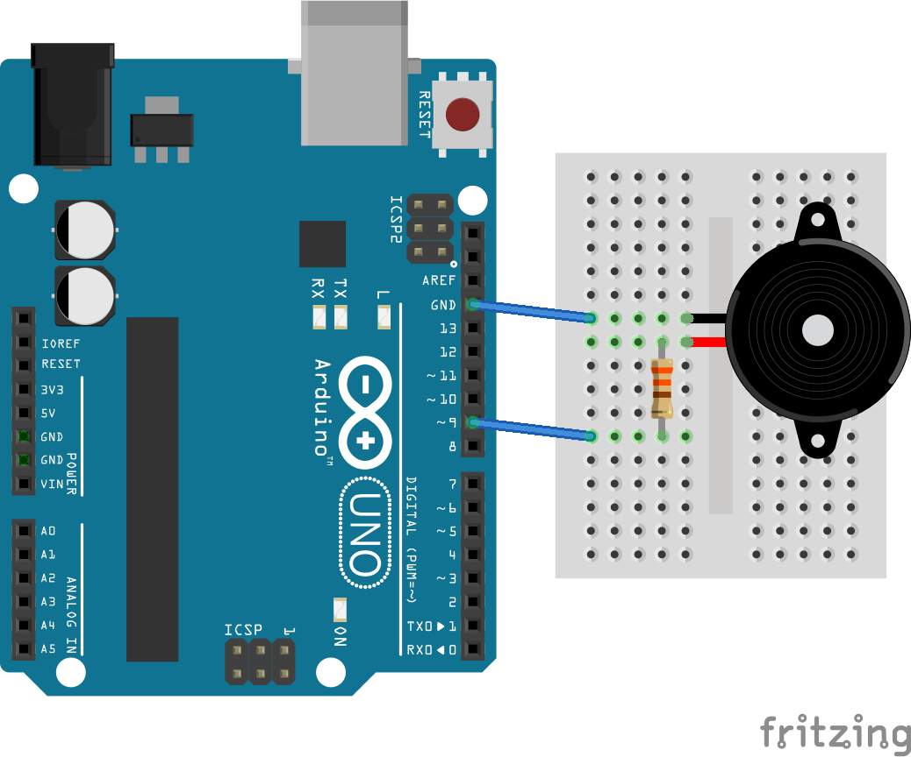

#Biraz da müzik


Biraz ses çıkarmanın vakti geldi. Ses üretmenin en kolay yolu buzzer kullanmaktır. Buzzer'ı minik bir hoparlör olarak düşünebilirsiniz. 

Piyasada iki çeşit buzzer bulabilirsiniz. Biri gerçek **Piezo Buzzer** diğeri **Piezo Transducer**. Piezo Transducer aslında sadece bir diyaframdan oluştuğu için **Piezo Diapraghm** olarak da adlandırılır. Farkı nedir? Piezo buzzer tek ve sabit bir tonda ses verirken, transducer ile farklı tonlar elde etmek mümkündür. Piezo Transducer'ı bizim elektronikçlerde pasif buzzer adıyla da bulabilirsiniz.

> Piezo buzzer ve transducer'ı birbirinden nasıl ayırırız? İkisini yan yana koyduğunuzda buzzer transducer'dan biraz daha kalındır. Yine de eğer emin olamıyorsanız gerilim uygulamayı deneyebilirsiniz. Piezo buzzerın bacaklarına voltaj uygulandığında kesintisiz bir 'beep' sesi alırsınız. Transducer da ise sadece bir 'click' sesi duyarsınız.

##Haydi işe koyulalım

Amacım müzik çalmak olduğu için devremde piezo transducer kullanacağım. Devremde sadece 330 ohm bir direnç buzzer'ım olacak. Aslında direç kullanmasam da olur ancak direnç kullanarak hem sesi biraz kısmış olacağım hem de Arduino'yu buzzer'da oluşabilecek voltajdan korumuş olacağım.

> Buzzer çift yönlü çalışır. Gerilim uygulandığında içindeki diyafram titrediği gibi, üstüne vurduğunuzda da gerilim üretir. Oluşan bu gerilim arduino'nun pinlerine zarar verebilir.

 
Buzzer'ı bağlarken polariteye dikkat etmeyi unutmayın. Aynı ledlerde olduğu gibi buzzerlarda da Vcc(+) bacağı GND(-)'ye göre daha uzundur.



Kullandığım buzzer'ın aslında bir piezo transducer olduğunu söylemiştim. Transducer'ı çalıştırmak için içindeki diyaframı titreştirmem gerekiyor. Bunun için Arduino'nun PWM özelliğinden faydalanacağım.

> PWM yani Pulse Widh Modulation dijital pinlerden Analog sinyal gönderiyormuş gibi yapmanın bir yöntemidir. Arduino Uno'nun dijital pinleri sadece 0 ve +5V volt verebilir. Ancak 3,5,6,9,10 ve 11 dijital pinler analog sinyal gönderiyormuş gibi yapabilirler nasıl mı? Kare dalga üreterek ve kare dalganın on (5 V) ve off (0 V) olduğu zaman dilimlerini değiştirerek.

Koduma pmw değerini tanımlayarak başlıdım. Bu değer sesin tonunu belirleyecek.

````
const int pmwValue = 200; //1 ile 255 arasnda bir deger verebilirsiniz.
```` 

Üç kısa bip sesiyle selam verelim. Gördüğünüz gibi ses çıkarma rutinine sürekli ihtiyacım olacağı için bu kısmı fonksiyon olarak tanımladım.

````
void setup()  { 
  // dijital pin 9'u cikis olarak ayarlayalim
  pinMode(9, OUTPUT);
  // 3 kisa beep
  beep(100);
  beep(100);
  beep(100);
} 
````
Ana döngü içinde ise önce 1 saniye es verip ardından 10 uzun beep yapalım.

````
void loop()  {
  //bir saniye bekleyelim
  delay(1000);
  //10 uzun beep
  for(int i=0; i<10; i++) {
    beep(200);
  } 
}
````
İşte esas işi yapan kod oldukça basit. Sadece 9. pine PWM değerini yazmamız yeterli. Diğer işlemleri mikrodenetleyici kendisi hallediyor. 

````
void beep(int sure){
  analogWrite(9, pmwValue);   
  delay(sure);          
  analogWrite(9, 0);      
  delay(sure);           
}  
````

##Sonuç
Buzzer'ın sesini duydum ama müzik çalamadım. En iyisi bu işi adımlara bölmek. Bu örneğin kodunu [beep/][1] klasörüne kaydettim. Müzik için ikinci bir program yazacağım. Devam yazısını [readme02.md][2]'den okuyabilirsiniz.

[1]: beep/
[2]: readme02.md


