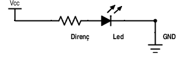

#Led Kullanımı ve Led Hesabı

"**L**ight **E**mitting **D**iode", kısaca LED, diyot temelli, ışık yayan bir elektronik devre elemanıdır.

Farkettiyseniz ledlerin bir bacağı kısa diğerinin uzundur. Kısa bacak katod, uzun bacak anottur. Devrelerimizde her zaman uzun bacağı Vcc(+) kısa bacağı GND(-) tarafına bağlayacağız. 

Ledler besleme gerilimine hasas bileşenlerdir. Üzerlerinden geçen akımın kontrol edilmesi gerekir. Doğrudan güç kaynağına bağlandıklarında yanarlar. Led üzerinden geçen akımı sınırlamak için seri olarak bağlanan bir dirençle beraber kullanılırlar.

##Led hesabı

Led hesabı yapabilmek için çalışma voltajı ve led gerilimi değerlerine ihtiyacımız var. Bu değerler üreticiye göre değişmekle birlikte menşeini bilmediğimiz 5mm'lik bir led için gerilim değerini **20 ma** olarak kabul edebiliriz.

Aşağıdaki tabloda tipik çalışma voltajı değerleri verilmiştir.

Renkler| Kırmızı|Turuncu|Sarı|Yeşil|Mavi|Beyaz
---|---|---|---|---|---|---
Çalışma Voltajı|1.8|2.0|2.1|2.2|3.3|3.3

5V'luk bir güç kaynağı ile kırmızı bir led kullanmak istediğimizi farzedelim. Ledin çalışma voltajı 1.8 olduğuna göre direncten harcanacak gerilim: 

**Vd = Vcc - Vl = 5 - 1.8 = 3.2V**

Akımın 20ma olması için gereken direnç:

**Vd = I x R**  
**R = Vd/I = 3.2/20 = 160 ohm**

Eğer hesapladığımız direnç elimizde yoksa elimizdeki en yakın büyük değerli direnci kullanırız.  

