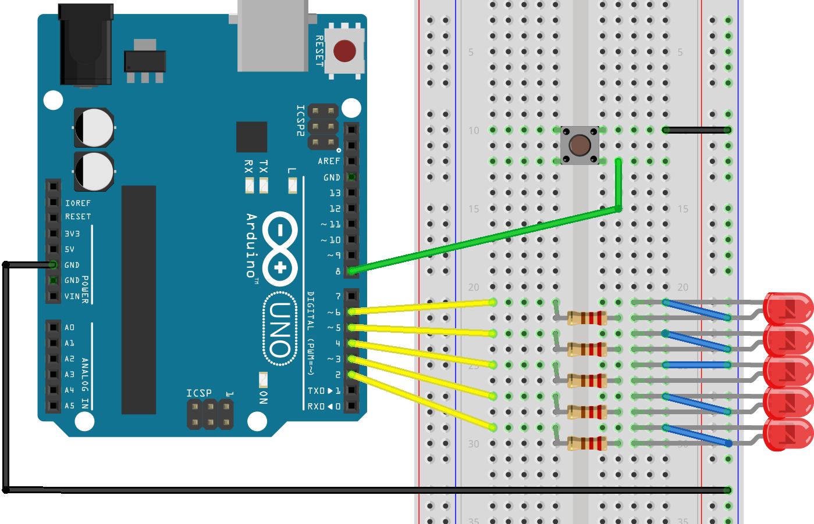

#Button Kullanımı

Led flash (nam-ı diğer Kara Şimşek) effektini çalıştırdığıma göre. Devreye bir de düğme ekleyerek bunu etkileşimli hale getirmemek için bir sebep yok.

Anlık çalışan butonlar iki farklı şekilde bağlanarak kullanılabiliyor. Pull-up ve Pull-down yöntemiyle. Ben Ardunio'nun kendi içindeki pull-up direncini kullanacağım. 
> Dahili pull_up dirence `pinMode(8,INPUT_PULLUP);` komutuyla etkinleştiriliyor. 

Buton'un bir bacağı 8 numaralı dijital pine, diğer bacağı GND'ye bağlı olacak. Bu durumda butonun bağlandığı pin normal durumda `HIGH` ben butona bastığımda `LOW` olacak.  

Yapmam gereken devreyi alttaki gibi değiştirmek ve [yeni sketchi ](https://github.com/wizofwor/arduino/blob/master/03-button/button/button.ino) yüklemek. Yeni devremde düğmeye bastığımda *kara şimşek* efekti çalışıyor.

