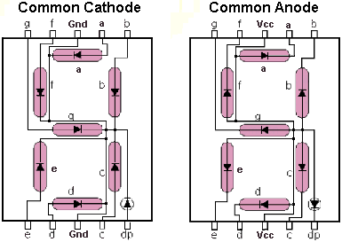

#7 Segmentli Gösterge


Bu yazıda en bilinen devre elemanlarından birini, 7 segmentli gösterge *(7 segment display)* kullanmayı öğreneceğiz.

7 segmentli göstergeler aslında bir arada dizilmiş 7 led'den *-noktayı da sayarsak 8*- oluşurlar. Ancak kullanım kolaylığı açısından ledlerin bazı ayakları birleştirilmiştir.

**Common Cathode** ve **Common Anod** olmak üzere iki tür gösterge türü bulunur. Common Cathode tipinde katod pinleri birleştirilmiştir. GND bağlantısı sadece iki noktadan yapılır. Diğer pinlere gerilim uygulanarak ledler yakılır ve bu sayede sayı ve harfler elde edilir. Common Anode tipinde ise Anot bağlantısı birleştirilmiştir. Bu sefer de GND bağlantısı sağlanan ledler yanar.

Aşağıde her iki tipteki göstergelerin iç yapısını inceleyebilirsiniz.



##Devre Kurulumu

İlk olarak ortak katodlu gösterge ile işle başlayacağım. a'dan g'ye kadar olan bağlantıları Arduino'nun 2-8 arasındaki pinlerine sırayla bağladım. Ortak katodu'da 330 ohm'luk direnç üzerinden GND'ye bağladım.

>Not: İncelediğim çoğu örnekte anod tarafında her bağlantının önüne birer direnç takıldığını gördüm. Her ne kadar bu şekildeki kullanımın daha sağlıklı olduğu söylense de pratiklik adına tek direnç kullanmayı tercih ettim. Tek direnç kullanmanın her hangi bir olumsuz etkisini de görmedim. 


##Sayaç Programı

7 segmentli göstergeyi denemek için 0'dan 9'a kadar sayan basit bir sayaç programı kodluyorum. 

Önce rakamları birer baytlık sayılar halinde tanımlıyorum. Örneğin '1' rakamı için 'b' ve 'c' ledlerini yakacağım. Bunun binary karşılığı `B011000` olacak.

````
/**
  * Sifirdan 9'a kadar rakamlari tanimlayalim.
  * 8 bitlik sayinin her biti bir ledi isaret edecek
  */
const byte rakamlar[11] = {
   B1111110,  // 0
   B0110000,  // 1
   B1101101,  // 2
   B1111001,  // 3
   B0110011,  // 4
   B1011011,  // 5
   B1011111,  // 6
   B1110000,  // 7
   B1111111,  // 8
   B1110011,  // 9
   B0000000,   // bos
   };
````

Sonra Arduino'nun hangi pinini göstergenin hangi bacağına bağladığımı bir array içinde kaydettim ve bu pinleri çıkışa yönlendirdim.

````
/**
  * ledi bagladigimiz pinleri tamilayalim
  */
                    // g,f,e,d,c,b,a    
const int pinler[7] = {8,7,6,5,4,3,2}; 

//pinleri cikisa yonlendirelim
void setup() {
  for(int i=2;i<=9;i++)
    pinMode(i, OUTPUT);  
}

````

Ana döngü içinde sıfırdan 9'a kadar rakamları çağırıyorum. Rakamları gösteren asıl kodu showDigit() fonksiyonunda tanımladım.

````
/*
 * dongu sifirdan 9'a kadar rakamlari dongu icinde gosterelim.
 */
void loop() {
  for (int i = 0; i <= 10; i++) {
   delay(1000);
   showDigit(i); 
  }
  delay(4000);
}

````

7 segmentli göstergeyi sürme işini showDigit() fonksiyonu içinde yapıyorum. Fonskiyon gösterilecek rakamı `int` olarak alıyor ve gerekli segmentleri `on` yapıyor.

7 segmenti sırayla kontrol eden bir for döngüsü kuruyorum.
`for (int segment=0 ; segment<7; segment++){...}`

Döngü içinde her bir segment için led'in yakılıp yakılmayacağını bitRead komutuyla öğreniyorum. `bitRead(x,n)` x sayısı içinden sırası verilen bitin değeri döndürüyor. 
`bitVal = bitRead(rakamlar[n],segment);`

DigitalWrite ile ilgili pinin değerini güncelliyorum.
`digitalWrite(pinler[segment],bitVal);`

Hepsi bir arada aşağıdaki gibi görünüyor.


````
void showDigit(int n) {
  boolean bitVal;
  //Gosterilecek rakamin segmentlerini dongu icinde kontrol edelim.
  for (int segment=0 ; segment<7; segment++) {
    //Segment bit degerini alalim.  
    bitVal = bitRead(rakamlar[n],segment);
    //Bit degerine gore segmenti yakalim.
    digitalWrite(pinler[segment],bitVal);
  }
}
````
##Ortak Anot

Ortak anot kullanan ikinci göstergemi sürmek için yine aynı devreyi ufak bir değişiklik yaparak kullanıyorum. GND yerine Vcc bağlantısı yapıyorum. 


Kodumda da ufak bir değişiklik yapmam gerekiyor. Bit'leri ters çeviriyorum.

````
const byte rakamlar[11] = {
   B0000001,  // 0
   B1001111,  // 1
   B0010010,  // 2
   B0000110,  // 3
   B1001100,  // 4
   B0100100,  // 5
   B0100000,  // 6
   B0001111,  // 7
   B0000000,  // 8
   B0001100,  // 9
   B1111111,   // bos
   };
````

Peki bu nasıl çalışıyor? LED'lerin yanması için Vcc'den gelen gerilimin led'üzerinden geçerek GND'ye bağlanması gerekirken ben bu bağlantıyı digital pinler üzerinden sağladım. İlgili pin'i `high` yaptığımda potansiyel farkı oluşmadığı için led yanmıyor. Pini `low` yaptığımda ise katod tarafındaki gerilim düşük kaldığı için led üzerinden akım geçebiliyor. Yani led yanıyor. Rakamları da bu yüzden ters çevirdim.

>Not: Bu metodu uygularken dikkatlı olmanızda fayda var. Eğer giriş/çıkış pinlerini direk olarak Vcc'ye bağlarsanız pinleri yakabilirsiniz.

